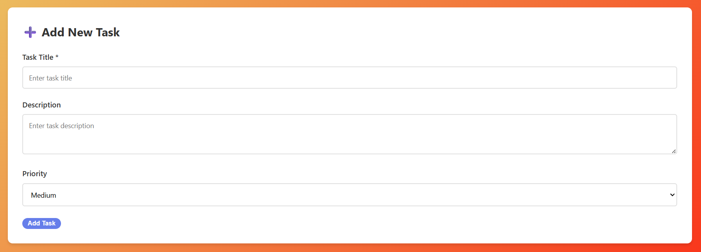

# 📘 ENGSE207 – Week 3 Lab  
## Monolithic Architecture – Task Board Application

โครงการนี้เป็นส่วนหนึ่งของรายวิชา **Software Architecture (ENGSE207)**  
โดยมุ่งเน้นการสร้างระบบ **Monolithic Application** แบบ Full-stack ด้วยเทคโนโลยี:

- **Node.js + Express.js**
- **SQLite Database**
- **HTML/CSS/JavaScript**

ระบบที่สร้างคือ **Task Board Application** ที่สามารถเพิ่มงาน ลบงาน และเลื่อนสถานะงานได้

---

# 🚀 ฟีเจอร์ของระบบ
✔ ดูรายการงานทั้งหมด  
✔ เพิ่มงานพร้อมคำอธิบายและ Priority  
✔ ลบงาน  
✔ เปลี่ยนสถานะงาน  
✔ Filter งานตามสถานะ  
✔ REST API ครบทุก method  

---

# 🏗 สถาปัตยกรรมที่ใช้
```
Monolithic Architecture
Frontend (HTML/CSS/JS)
Backend (Express)
Database (SQLite)
ทั้งหมดรวมอยู่ในโปรเจกต์เดียว
```

---

# 📂 โครงสร้างไฟล์โปรเจกต์
```
week3-monolithic/
├── server.js
├── package.json
├── database/
│   ├── schema.sql
│   └── tasks.db
├── public/
│   ├── index.html
│   ├── style.css
│   └── app.js
└── README.md
```

---

# 🔌 API Endpoints

| Method | Endpoint | Description |
|--------|-------------|-------------|
| GET | /api/tasks | ดึงงานทั้งหมด |
| GET | /api/tasks/:id | ดึงงาน 1 อัน |
| POST | /api/tasks | เพิ่มงานใหม่ |
| PUT | /api/tasks/:id | แก้ไขงาน |
| DELETE | /api/tasks/:id | ลบงาน |
| PATCH | /api/tasks/:id/status | อัปเดตสถานะ |

---

# 💾 Database Schema
```sql
CREATE TABLE tasks (
    id INTEGER PRIMARY KEY AUTOINCREMENT,
    title TEXT NOT NULL,
    description TEXT,
    status TEXT DEFAULT 'TODO',
    priority TEXT DEFAULT 'MEDIUM',
    created_at DATETIME DEFAULT CURRENT_TIMESTAMP,
    updated_at DATETIME DEFAULT CURRENT_TIMESTAMP
);
```

---

# 🖼️ ผลลัพธ์การทำงาน (Screenshots)

### ➕ เพิ่มงานใหม่


### 🔄 เปลี่ยนสถานะงาน


---

# ⚙️ วิธีติดตั้งและรัน

```bash
npm install
cd database
sqlite3 tasks.db < schema.sql
cd ..
npm run dev
```

เปิดเว็บ: **http://localhost:3000**

---

# 📤 สิ่งที่ต้องส่ง
- Source Code  
- README.md  
- REFLECTION.md  
- Git commit history  
- ZIP (ไม่มี node_modules)

---

# ✨ ผู้จัดทำ  
**ธาวัน ทิพคุณ รหัสนักศึกษา 67543210033-6**  
ENGSE207 – Software Architecture# week3-starter-code
