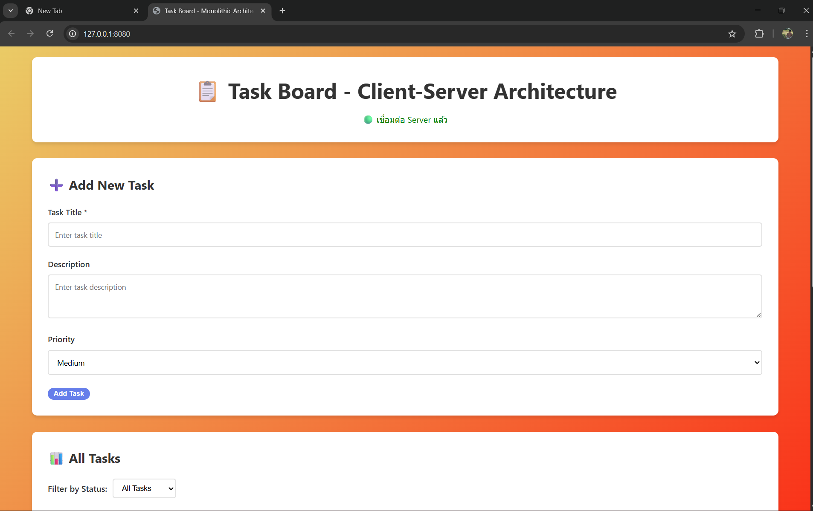

# Week 5: Task Board - Client-Server Architecture

## Overview
This project demonstrates **Client-Server Architecture** where the application is split into two distinct parts running on different environments:

- **Client (Frontend):** Runs on the local machine using a lightweight web server
- **Server (Backend):** Runs on an Ubuntu Server Virtual Machine exposing REST APIs
- **Communication:** HTTP over network (different machines)

---

## Architecture Comparison

### Week 4: Layered (Single Machine)
All components run on the same machine and process.

Browser  
→ Controller  
→ Service  
→ Repository  
→ Database (localhost)

---

### Week 5: Client-Server (Two Machines)
Frontend and Backend are decoupled and communicate over network.

Local Machine (Frontend)  
`http://localhost:8080`  
⬇ HTTP Request  
Virtual Machine (Backend)  
`http://192.168.56.106:3000`  
⬇  
SQLite Database

---

## Project Structure

### Local Machine (Frontend)
```
week5-client-server/
└── public/
    ├── index.html     # UI
    ├── style.css      # Styling
    ├── app.js         # Client Logic (Fetch API)
    └── config.js      # Backend API Configuration
```

### Virtual Machine (Backend)
```
~/projects/task-board-api/
├── server.js               # Express entry point
├── ecosystem.config.js    # PM2 configuration
├── src/
│   ├── controllers/
│   ├── services/
│   └── repositories/
└── database/
```

---

## Setup Instructions

### 1. Backend Setup (Virtual Machine)
See detailed steps in [DEPLOYMENT.md](DEPLOYMENT.md)

```bash
ssh devlab@192.168.56.106
cd ~/projects/task-board-api
pm2 start ecosystem.config.js
```

---

### 2. Frontend Setup (Local Machine)

```bash
cd public
npx http-server -p 8080 -c-1
```

Open browser:  
👉 http://localhost:8080

---

### 3. API Configuration

Edit `public/config.js`

```javascript
const API_CONFIG = {
  BASE_URL: 'http://192.168.56.106:3000',
  ENDPOINTS: {
    TASKS: '/api/tasks',
    STATS: '/api/tasks/stats'
  }
};
```

---

## Connectivity Test Results (Client ↔ Server)

### ✅ Case 1: Server Connected Successfully
The frontend can successfully communicate with the backend API.
This indicates correct network configuration, API availability, and CORS setup.



**Observed Result**
- Green status indicator
- Tasks can be loaded and managed
- REST API requests return valid responses

---

### ❌ Case 2: Server Not Connected
The backend server is unavailable (e.g. VM stopped or API down).


**Observed Result**
- Red status indicator
- Loading state persists
- Client cannot fetch data from the server

---

## Technologies Used

### Frontend
- HTML5
- CSS3
- JavaScript (ES6+)
- Fetch API

### Backend
- Node.js
- Express.js
- SQLite3
- PM2

### Infrastructure
- Ubuntu Server 22.04 LTS
- VirtualBox
- SSH, HTTP
- CORS

---

## API Documentation

**Base URL:**  
`http://192.168.56.106:3000`

| Method | Endpoint | Description |
|------|---------|------------|
| GET | /api/tasks | Get all tasks |
| POST | /api/tasks | Create new task |
| PATCH | /api/tasks/:id/status | Update task status |
| DELETE | /api/tasks/:id | Delete task |
| GET | /api/tasks/stats | Task statistics |

---

## Conclusion
This project demonstrates a clear transition from a **Layered Architecture** to a **Client-Server Architecture**, highlighting real-world concerns such as network communication, service availability, and system reliability.

