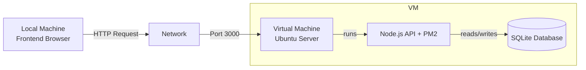

# Deployment Guide - Week 5

## Server Information
- **VM OS:** Ubuntu Server 22.04 LTS
- **VM IP:** 192.168.56.106
- **SSH Access:** `ssh devlab@192.168.56.106`
- **API Endpoint:** `http://192.168.56.106:3000`

## Architecture


## Deployment Steps

### 1. Access VM
```bash
ssh devlab@192.168.56.106
```

### 2. Navigate to Project
```bash
cd ~/projects/task-board-api
```

### 3. Update Code
```bash
git pull origin main
npm install
```

### 4. Restart Application
```bash
pm2 restart task-board-api
```

### 5. Check Status
```bash
pm2 status
pm2 logs task-board-api --lines 20
```

## Accessing Services

### API
- http://192.168.56.106:3000/api/tasks
- http://192.168.56.106:3000/api/tasks/stats

### Frontend (Local)
```bash
npx http-server -p 8080 -c-1
```

## Troubleshooting

### API not accessible
```bash
pm2 status
sudo ufw status
sudo netstat -tlnp | grep 3000
```

### Database errors
```bash
ls -lh database/tasks.db
sqlite3 database/tasks.db "SELECT COUNT(*) FROM tasks;"
```

### Application crashes
```bash
pm2 logs task-board-api --err
pm2 restart task-board-api
```

## Maintenance

### Daily
- pm2 status
- pm2 logs --lines 20

### Weekly
```bash
pm2 flush
df -h
```

